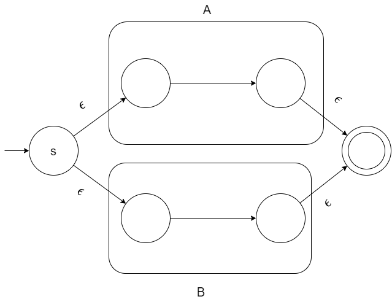

## Lexer Dest
构造一个自动的词法分析器，能够分析如下规则的正则表达式

[中科大的华保健编译原理](https://www.bilibili.com/video/BV16h411X7JY/?spm_id_from=333.999.0.0)

```
[a-z], from a to z
[0-9] from 0 to 9
| : a|b ; hello world | hello earth
concat: abcdefg
* : Kleene closure
+ : positive closure
some indent chars.
\s: space
```

## 需要实现的Lab(算法)
1. Tompson 算法分析正则表达式，构造出NFA
2. 子集构造算法将NFA转换为DFA，目的是生成一个确定的转换表
3. Hopocroft 算法（选做）：优化DFA

### Tompson 算法
总的来说，就是使用 $\epsilon$ 实现正则表达式的并，连接，还有闭包。闭包就是重复，分为Kleene 闭包和正闭包分别代表重复0次或多次以及至少重复一次。

* 实现连接: 很简单，两个状态之间连上一个 $\epsilon$ 即可。
* 实现并：如图所示，实现 A|B



* 实现重复: R* 


如果是正闭包就去掉下面那个 epsilon 飞线就行
