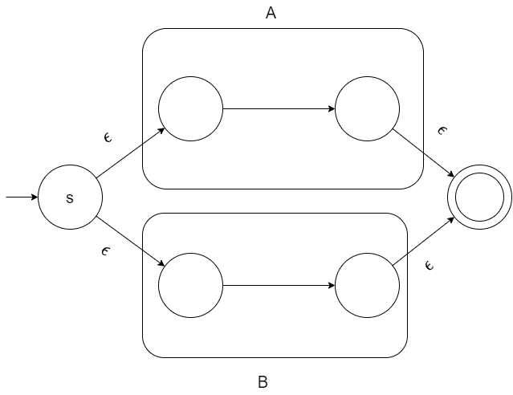

## Lexer Dest
构造一个自动的词法分析器，能够分析如下规则的正则表达式

[中科大的华保健编译原理](https://www.bilibili.com/video/BV16h411X7JY/?spm_id_from=333.999.0.0)

```
[a-z], from a to z
[0-9] from 0 to 9
| : a|b ; hello world | hello earth
concat: abcdefg
* : Kleene closure
+ : positive closure
some indent chars.
\s: space
```

## 需要实现的Lab(算法)
1. Tompson 算法分析正则表达式，构造出NFA
2. 子集构造算法将NFA转换为DFA，目的是生成一个确定的转换表
3. Hopocroft 算法（选做）：优化DFA

### Tompson 算法
总的来说，就是使用 $\epsilon$ 实现正则表达式的并，连接，还有闭包。闭包就是重复，分为Kleene 闭包和正闭包分别代表重复0次或多次以及至少重复一次。

* 实现连接: 很简单，两个状态之间连上一个 $\epsilon$ 即可。
* 实现并：如图所示，实现 A|B



* 实现重复: R* 


如果是正闭包就去掉下面那个 epsilon 飞线就行

实现难度不高，连图就行
### 子集构造法
子集构造法将 NFA转换为DFA

前置概念：

* $\epsilon$ 闭包: NFA 中一个状态或状态集合经过一个或多个 $\epsilon$ 走到的状态集合我们称为 $\epsilon$ 闭包（$\epsilon-closure$)
* $move$ 函数， $move(T,a)$ 能从 $T$ 中某个状态 $s$ 出发通过 $a$ 符号转换到达的NFA状态集合。

算法思想

1.  我们先处理一下所有单个NFA状态的$\epsilon-closure$ 函数。

2. 我们将 NFA 初始状态 $s_0$ 可以经过 $\epsilon$ 闭包的状态集合作为 DFA 的初始状态 $T_0$，然后不停的计算 $T_0$ 经过一些符号能到达的状态集合(计算move函数) $T_1,T_2,T_3 \cdots$ 然后不停的 dfs 直到没有新的状态集合产生。

实现见: subset-cons.cpp 